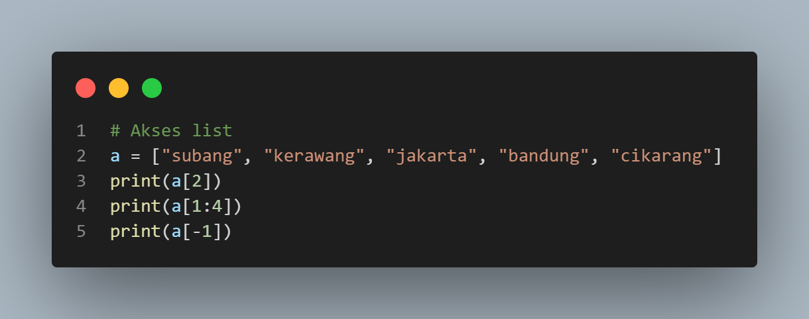
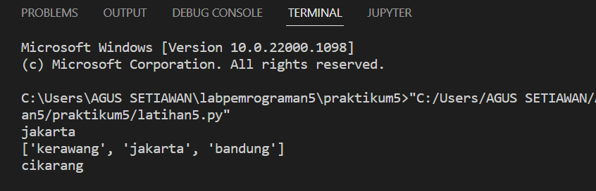
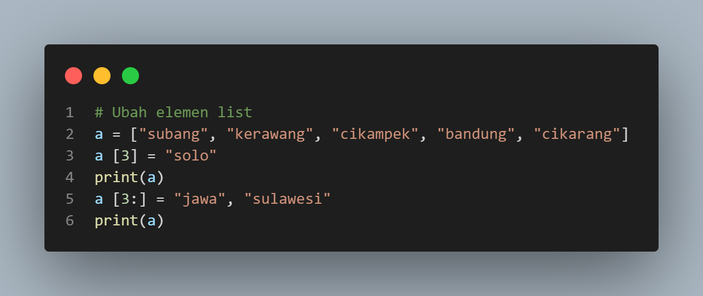
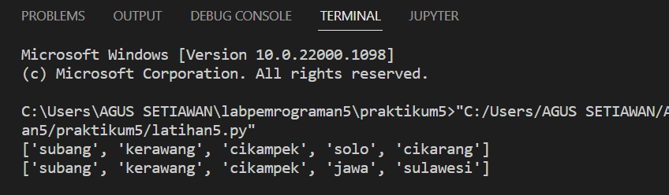
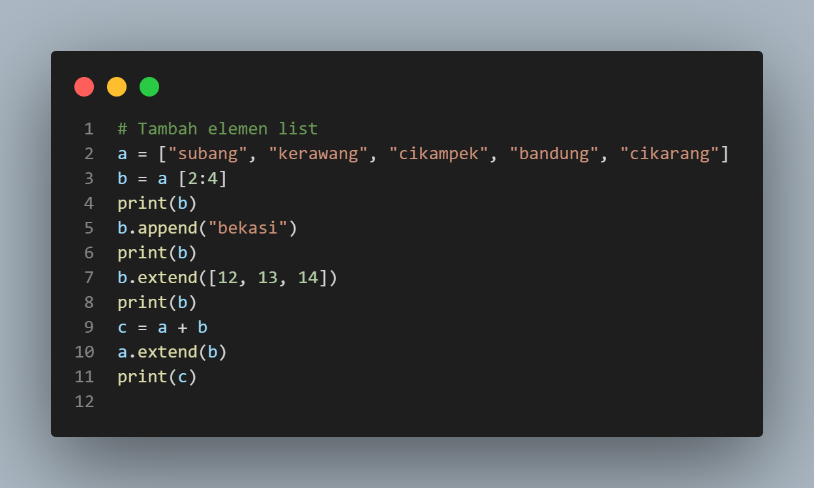
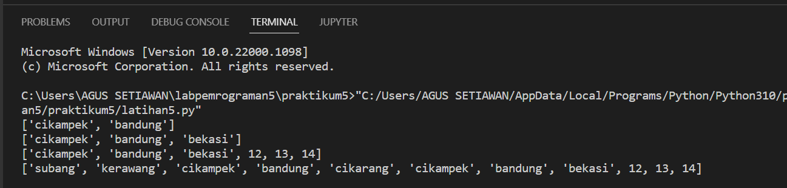
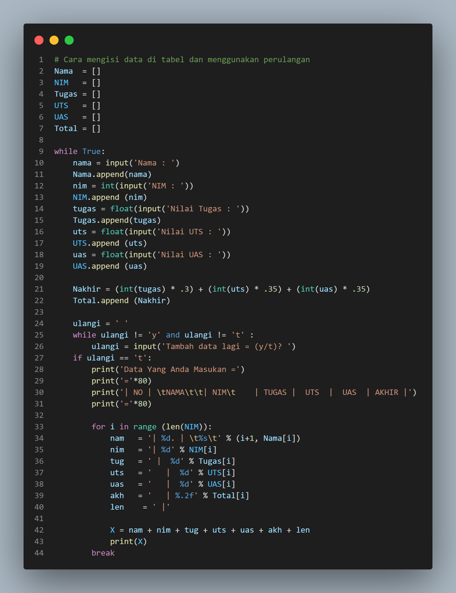
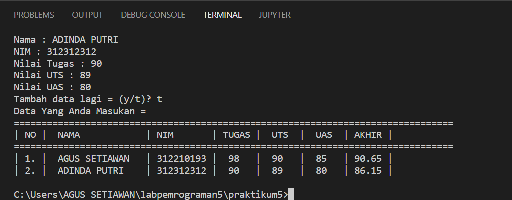

## PRAKTIKUM 5
## Latihan
## Buatlah sebuah list sebanyak 5 elemen dengan nilai bebas.

#### Akses list :
- Tampilkan elemen ke 3
- Ambil nilai ke 2 sampai elemen ke 4
- Ambil elemen terakhir

#### Output

#### Ubah elemen list :
- ubah elemen ke 4 dengan nilai lainnya
- ubah elemen ke 4 sampai dengan elemen terakhir

#### Output

#### Tambah elemen list :
- Ambil 2 bagian dari list pertaman (A) dan jadikan list ke 2 (B)
- Tambah list (B) dengan nilai string
- Tambah list (B) dengan 3 nilai
- Gabungkan list (B) dengan list (A)

- Output

## TUGAS PRAKTIKUM 5
### Buatlah program sederhana untuk menambahkan data ke dalam sebuah list dengan rincian:
- Buatlah program meminta masukan data sebanyak-banyaknya (gunakan perulangan)
- Tampilkan sebuah pilihan untuk menambahkan data **(y/t)?**, apabila jawaban t (tidak) maka program akan menampilkan daftar datanya.
- Nilai akhir dihitunng dari perhitungan 3 komponen nilai (tugas : 30%, uts : 35%, uas : 35%)
- Buat Flowchart dan penjelasannya programnya pada file README.md
- Commit dan push repository github
selamat mengerjakan...

#### Langkah- langkah program
- Pertama kita akan membuat program, dan akan membuat perulangan supaya kita bisa menampilkan data sebanyak-banyakya.
- setelah dibuat, kita akan diminta untuk memilih/pilihlah **(y/t)?**, jika kita input **(y)** maka akan diminta untuk **masukan data lagi**. bilamana kita input **(t)** maka program akan **selesai** dan akan menampilka data yang sudah di masukan.
- supaya dibikin seperti tabel kita buat dengan format string agar kelihatan tersusun rapih.
## Tampilan program

#### Output

#### Tampilan Flowchart

## tetap Semangat :)

